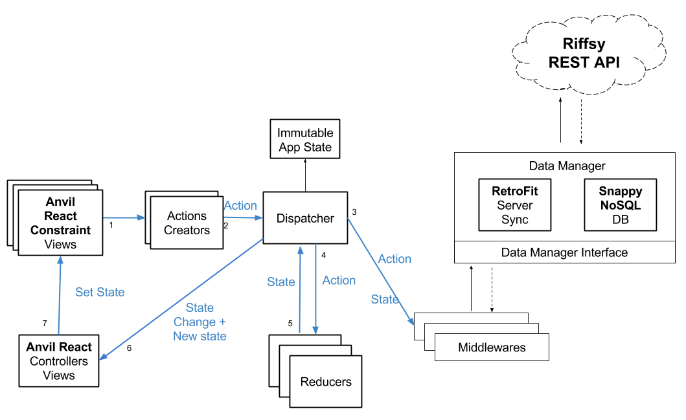

# redux-android-sample

[](http://drone.catbag.com.br/Catbag/redux-android-sample)

An Android sample that implements Redux architecture (using [Fluxxan](https://github.com/frostymarvelous/Fluxxan) and [Anvil](https://github.com/zserge/anvil)) and NoSQL (using [SnappyDB](https://github.com/nhachicha/SnappyDB))

# Architecture


#App State Example
``` javascript
{
    hasMoreGifs: true,
    gifs: [{
        path: "path",
        url: "url",
        title: "string",
        watched: false,
        status: PAUSED //PAUSED, LOOPING, DOWNLOADING, DOWNLOADED, NOT_DOWNLOADED, DOWNLOAD_FAILED
    }]
}
```

#Tests

- [Testing fundamentals](https://stuff.mit.edu/afs/sipb/project/android/docs/tools/testing/testing_android.html)
- [Tests The Android Way](https://www.bignerdranch.com/blog/testing-the-android-way/)
- [Espresso Test Life Cycle](https://jabknowsnothing.wordpress.com/2015/11/05/activitytestrule-espressos-test-lifecycle/)
- [Tests with Espresso, Mockito, Dagger 2](https://engineering.circle.com/instrumentation-testing-with-dagger-mockito-and-espresso-f07b5f62a85b#.5rti2kl2e)
- [Espresso Tutorial](http://www.vogella.com/tutorials/AndroidTestingEspresso/article.html#espresso_exercisesimple)
- [Roboeletric vs Android Test Framework](http://stackoverflow.com/questions/18271474/robolectric-vs-android-test-framework)

###Integration tests

- The integration tests are running on top of espresso framework, and using 
mockito to handle mocks.

To setup a CI or run tests in command line use this command:

    adb shell am instrument -w br.com.catbag.gifreduxsample.test/android.support.test.runner.AndroidJUnitRunner


###Unit tests

- The unit tests are running with [roboeletric](http://robolectric.org/), that is a android test framework with
builtin mock capabilities of android sdk. The roboeletric give us the power to run some unit tests 
with functions from android SDK without the requirement of an emulator running, what results 
in very fast tests.

To run unit tests through a CI or command line:

    ./gradlew  clean test --daemon --continue

### Drone CI

#### Running drone build locally

* [Install](http://readme.drone.io/devs/cli/#install:b659b046131d4024ab5e2d3675716bf0) drone CLI

        curl http://downloads.drone.io/drone-cli/drone_linux_amd64.tar.gz | tar zx
       sudo install -t /usr/local/bin drone

* Run drone build inside project dir

        drone exec --trusted
        
#### CI last build reports
        
* [Instrumentation tests](https://catbag.github.io/redux-android-sample/app/build/reports/androidTests/connected/)
* [Unit tests](https://catbag.github.io/redux-android-sample/app/build/reports/tests/debug)
* [Coverage](https://catbag.github.io/redux-android-sample/app/build/reports/coverage/debug)
* [PMD](https://catbag.github.io/redux-android-sample/app/build/reports/pmd/pmd.html)
* [Findbugs](https://catbag.github.io/redux-android-sample/app/build/reports/findbugs/findbugs.html)
* [Checkstyle](https://catbag.github.io/redux-android-sample/app/build/reports/checkstyle/checstyle.html) (without errors, no page generated)
* [Artifacts history](https://github.com/Catbag/redux-android-sample/tree/gh-pages)

#Good Practices

###Actions Creators

- Pay attention on action creation UI calls that do something async and 
dispatch action, the main action has to be dispatched before other async
created actions, and its not a good practice dispatch two actions on the 
same synchronous cycle.

## CODE INSPECT 

### How to use

1. Run **check** task on _Gradle Tasks -> verification_

2. After this attention on Android Studio **Run** console
or on gradle output if you run on terminal.

3. The reports are inside **app/build/reports/tool_name** folders.
_eg. flux-android-sample/app/build/reports/lint_

4. The inspect tools custom configurations are inside **app/inspect/**
folder.

5. Problems found by inspect tools stops the **check** task.

### References

[Summary](http://vincentbrison.com/2014/07/19/how-to-improve-quality-and-syntax-of-your-android-code/)

[Checkstyle](https://github.com/checkstyle/checkstyle)

[FindBugs](http://findbugs.sourceforge.net/)

[PMD](http://pmd.github.io/)

[Android Lint](https://developer.android.com/studio/write/lint.html)
